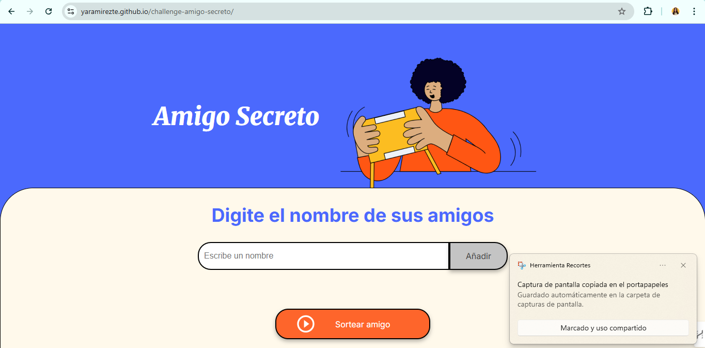
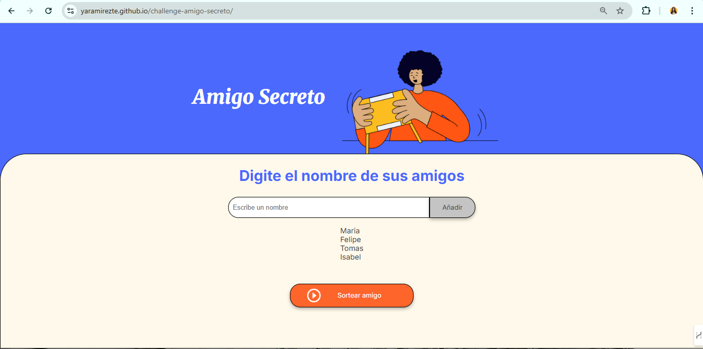
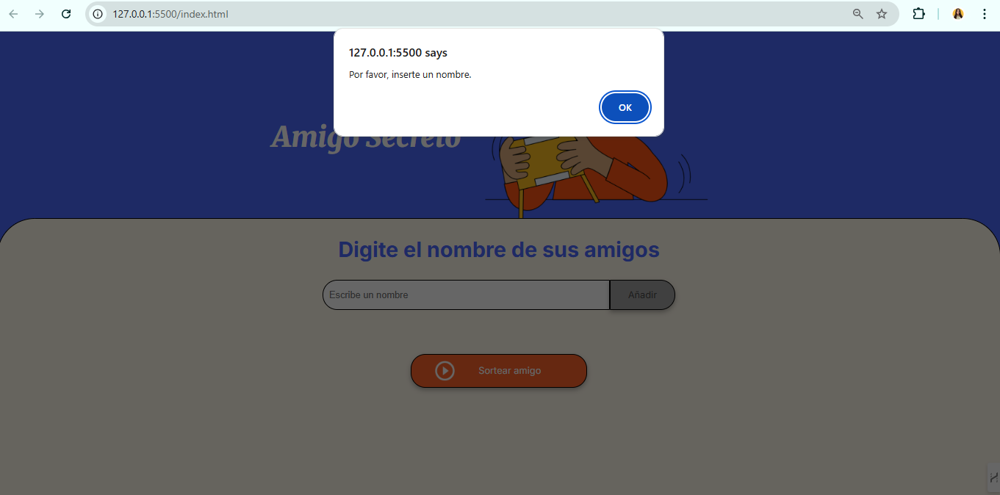
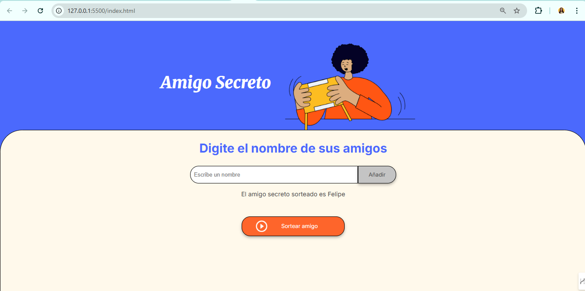

# 🎁 Proyecto Amigo Secreto

Este proyecto es una aplicación web interactiva que permite registrar nombres de amigos y realizar un sorteo aleatorio para determinar un "amigo secreto". Fue desarrollado en el marco del curso de **JavaScript** de [Alura Latam](https://www.aluracursos.com/), siguiendo prácticas de desarrollo ágil.

---

## 📌 Descripción

La interfaz HTML y los estilos CSS fueron proporcionados por el equipo de Alura, mientras que la **lógica de programación en JavaScript fue implementada desde cero por mí**, incluyendo:

- Registro dinámico de participantes
- Validación de entrada
- Actualización automática del DOM
- Lógica de sorteo aleatorio
- Limpieza del campo de entrada

---

## 🛠️ Funcionalidades

- ✅ Agregar nombres de participantes a una lista
- 🧹 Validación y limpieza del campo de entrada
- 📝 Renderizado automático de los nombres en la pantalla
- 🎲 Sorteo aleatorio de un "amigo secreto"
- ⚠️ Mensajes de advertencia si no se ingresan nombres

---

## 🚀 Tecnologías utilizadas

- **HTML5** (proporcionado por Alura)
- **CSS3** (proporcionado por Alura)
- **JavaScript ES6** (desarrollado por mí)
- **Git y GitHub** (control de versiones)
- **Trello** (gestión de tareas con metodología ágil)

---

## Metodología y control de versiones

Este proyecto fue desarrollado siguiendo metodología ágil, con tareas organizadas en Trello y versiones controladas mediante Git. Se realizaron commits para documentar avances y mejoras.

---

## 💻 Capturas de pantalla

### 🖼️ Interfaz principal


### 🧑‍🤝‍🧑 Lista de participantes


### 📢 Alerta por campo vacío


### 🎉 Resultado del sorteo


---

## 🔄 Proceso de desarrollo

- El repositorio fue creado desde **Git** de forma local y vinculado con GitHub.
- Se realizaron **commits progresivos** durante el desarrollo, siguiendo buenas prácticas de control de versiones.
- Las tareas fueron organizadas en **Trello**, simulando un entorno ágil de trabajo (tipo Scrum/Kanban).

---

## 🗂 Estructura del proyecto
```
/amigo-secreto
│
├── index.html         # Estructura de la página (proporcionado por Alura)
├── style.css          # Estilos (proporcionado por Alura)
├── app.js             # Lógica en JavaScript (desarrollada por mí)
├── README.md          # Documentación del proyecto
└── /assets            # Imágenes del proyecto y capturas de pantalla

```

---

## Autores

- [Yeni Andrea Ramirez Tellez](https://github.com/yaramirezte) – Desarrollador de la lógica en JavaScript.
- Proyecto basado en material y diseño proporcionado por Alura.

---

## Contacto

Puedes contactarme en:  
- GitHub: [yaramirezte](https://github.com/yaramirezte)  
- Email: yaramirezte@gmail.com
